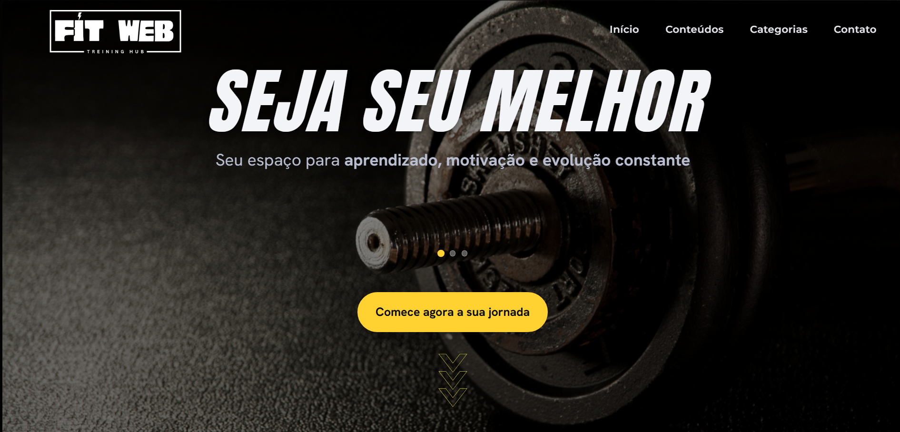
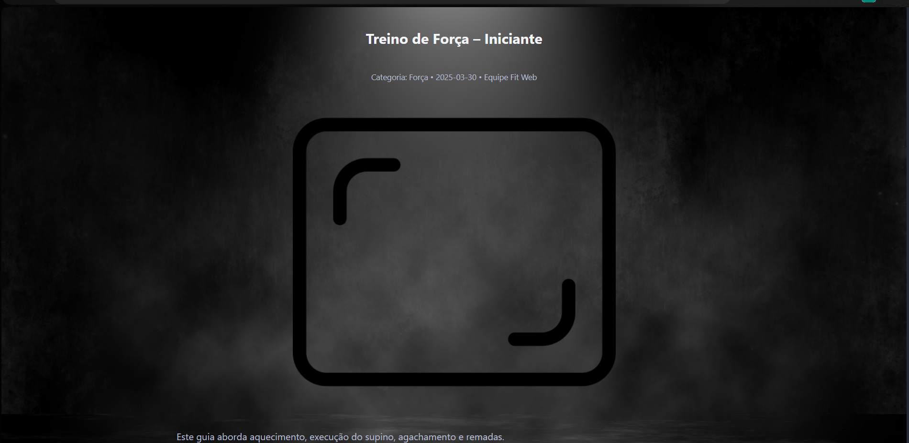

[](https://classroom.github.com/online_ide?assignment_repo_id=20877742&assignment_repo_type=AssignmentRepo)
# Trabalho Prático 05 - Semanas 7 e 8

**Páginas de detalhes dinâmicas**

Nessa etapa, vamos evoluir o trabalho anterior, acrescentando a página de detalhes, conforme o  projeto escolhido. Imagine que a página principal (home-page) mostre um visão dos vários itens que existem no seu site. Ao clicar em um item, você é direcionado pra a página de detalhes. A página de detalhe vai mostrar todas as informações sobre o item do seu projeto. seja esse item uma notícia, filme, receita, lugar turístico ou evento.

Leia o enunciado completo no Canvas. 

**IMPORTANTE:** Assim como informado anteriormente, capriche na etapa pois você vai precisar dessa parte para as próximas semanas. 

**IMPORTANTE:** Você deve trabalhar e alterar apenas arquivos dentro da pasta **`public`,** mantendo os arquivos **`index.html`**, **`styles.css`** e **`app.js`** com estes nomes, conforme enunciado. Deixe todos os demais arquivos e pastas desse repositório inalterados. **PRESTE MUITA ATENÇÃO NISSO.**

## Informações Gerais

- Nome: Arthur Emmanuel Oliveira Marinho
- Matricula: 900544
- Proposta de projeto escolhida: Proposta: Temas e Conteúdos Associados - Entidade Principal: Tema: Fitness, Musculação - Entidade Secundária: Conteúdos/Recursos: Dicas e video-aulas incorporadas do Youtube sobre treino e dieta. - Exemplos Temáticos: Vídeos, cursos, posts, categorias e dicas.
- Breve descrição sobre seu projeto: Fit Web – Training Hub é um site pessoal que reúne conteúdos de musculação (vídeo-aulas e artigos) para estudo e motivação. A página inicial traz uma chamada clara — “Seja seu melhor” — com botão de ação, seguida de Posts em Destaque, Lista de Posts e Categorias (Força, Hipertrofia, Mobilidade, Nutrição e Planejamento), facilitando o acesso rápido ao que o usuário procura. O visual usa tema escuro com destaques em amarelo e vermelho, reforçando energia e contraste, e cartões leves que priorizam títulos e imagens. Há pequenos efeitos de interação (hover) para dar feedback ao usuário e uma citação motivacional que encerra a página. O layout é responsivo, com navegação simples e tipografia legível, visando oferecer uma experiência direta, agradável e motivadora.

## Print da Home-Page



## Print da página de detalhes do item



## Cole aqui abaixo a estrutura JSON utilizada no app.js

```javascript
const dados = [
  {
    id: 1,
    titulo: "Treino de Força – Iniciante",
    resumo: "Primeiros passos e técnica correta.",
    categoria: "Força",
    autor: "Equipe Fit Web",
    data: "2025-03-30",
    imagem: "imgs/display-frame.png",
    thumb: "imgs/frame.png",
    conteudo: `
      <p>Este guia aborda aquecimento, execução do supino, agachamento e remadas.</p>
      <p>Foque em técnica antes de carga. Progrida 2,5–5 kg por semana.</p>
    `
    },
    {
        id: 2,
        titulo: "Mobilidade para Agachamento",
        resumo: "Sequência rápida para abrir quadril e tornozelo.",
        categoria: "Mobilidade",
        autor: "Equipe Fit Web",
        data: "2025-03-28",
        imagem: "imgs/display-frame.png",
        thumb: "imgs/frame.png",
        conteudo: `
      <p>Rotinas de 10 minutos melhoram profundidade e estabilidade do agachamento.</p>
    `
  },
  {
    id: 3,
    titulo: "Como progredir cargas",
    resumo: "Três métodos simples para evoluir sem estagnar.",
    categoria: "Planejamento",
    autor: "Equipe Fit Web",
    data: "2025-03-25",
    imagem: "imgs/display-frame.png",
    thumb: "imgs/frame.png",
    conteudo: `
      <p>Progressão linear, ondulatória e dupla. Use RPE e limites semanais.</p>
    `
  },
  {
    id: 4,
    titulo: "Nutrição para hipertrofia",
    resumo: "Proteínas, carboidratos e timing ao seu favor.",
    categoria: "Nutrição",
    autor: "Equipe Fit Web",
    data: "2025-03-20",
    imagem: "imgs/display-frame.png",
    thumb: "imgs/frame.png",
    conteudo: `
      <p>Superávit leve (5–10%), 1.6–2.2 g/kg de proteína e 3–6 g/kg de carbo.</p>
    `
  }
];
```